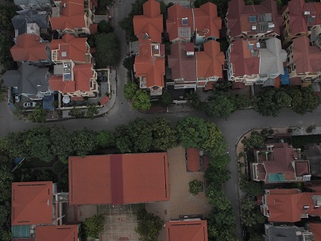
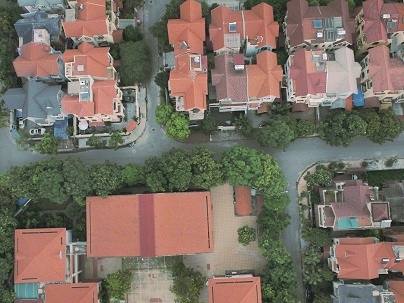
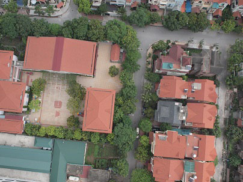

# HistogramMatching
Khớp biểu đồ mức xám.  

Ảnh cần xử lý và ảnh kết quả  
   
Ảnh tham chiếu  

## Mô tả
Khi thực hiện ghép nhiều hình ảnh với nhau, hình ảnh kết quả luôn có độ sáng không đồng đều. Bởi mỗi ảnh thành phần đều có độ sáng tối khác nhau. Do vậy cần thiết phải điều chỉnh độ sáng của các ảnh thành phần theo một ảnh tham chiếu để thống nhất. 

## Sử dụng
HistogramMatching -i test\input.jpg -r test\reference.jpg -o test\output.jpg

## Yêu cầu biên dịch
- OpenCV để thao tác xử lý ảnh.
- Boost để xử lý các đối số dòng lệnh.
